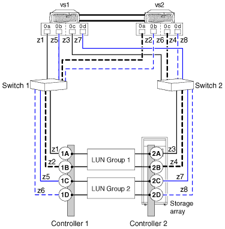

= 两个4端口阵列LUN组配置
:allow-uri-read: 
:icons: font
:imagesdir: ../media/

[role="lead"]
在此配置中、每个ONTAP FC启动程序端口对都会访问一个单独的阵列LUN组。分区是指一个ONTAP FC启动程序到一个阵列目标端口。

此配置支持与互操作性表中列出的所有存储阵列一起使用、就像在系统上运行的ONTAP版本支持的那样。

下图显示了此配置的结构图：

* 相关信息 *

https://mysupport.netapp.com/matrix["NetApp 互操作性表工具"]
