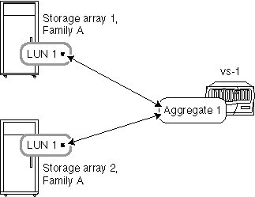

= 存储阵列属于同一系列时的聚合规则
:allow-uri-read: 
:icons: font
:imagesdir: ../media/

[role="lead"]
如果存储阵列来自同一存储阵列供应商和型号系列、则如何在聚合中布局阵列LUN适用特定规则。

如果您的存储阵列来自同一供应商、则将阵列LUN添加到聚合的规则如下：

* 如果存储阵列属于同一系列、则可以在同一聚合中混用存储阵列中的阵列LUN。
* 您可以将阵列LUN分隔为不同的聚合。

以下示例显示了当ONTAP系统背后的存储阵列属于_the some供应商系列_时、在聚合中布置阵列LUN的一些选项。

[NOTE]
====
为简单起见、图中仅显示两个存储阵列；您的部署可以包括更多存储阵列。

====

== 示例1：将所有存储阵列中的LUN添加到单个聚合

如下图所示、您可以创建一个聚合、然后将同一系列中所有存储阵列中的所有LUN添加到同一聚合：

== 示例2：在多个聚合上分布和混合存储阵列中的LUN

如下图所示、您可以创建多个聚合、然后在这些聚合上分布和混合来自同一系列中不同存储阵列的阵列LUN：

image:../media/luns_from_same_family_mixed_in_multiple_aggrs.gif[""]

[NOTE]
====
如果您的存储阵列型号相同、其中一个包含光纤通道驱动器、而另一个存储阵列包含SATA驱动器、则不支持此示例。在这种情况下、这些存储阵列不会视为属于同一系列。

====