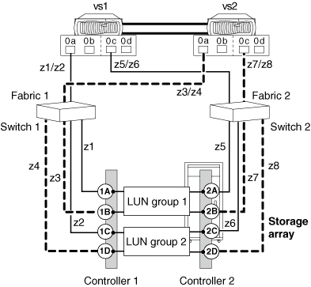

= 配置示例：共享FC启动程序端口
:allow-uri-read: 
:icons: font
:imagesdir: ../media/

[role="lead"]
ONTAP系统上的一个FC启动程序端口最多可以连接到不同存储阵列上的四个目标端口、对于某些存储阵列、也可以连接到同一存储阵列上的四个目标端口。

最佳实践分区建议是、将每个FC启动程序-目标端口对置于一个单独的分区(1：1)中、即使同一个FC启动程序正在与多个目标端口进行通信也是如此。

== 连接到_SETTLGE_存储阵列上多个目标端口的共享FC启动程序端口

下图显示了用于与_煌_存储阵列上的目标端口共享FC启动程序端口的连接和分区。

下图中的实线显示了从系统VS1上的FC启动程序端口进行的连接、虚线显示了从系统VS2上的FC启动程序端口进行的连接。

image::../media/shared_initiator_ports_different_arrays.gif[共享启动程序端口不同的阵列]

下表显示了一个FC启动程序端口在不同存储阵列上共享多个目标端口的示例中的1：1分区定义。

|===
| 分区 | ONTAP系统和FC启动程序端口 | 存储阵列 

 a| 
* 交换机 1*

 a| 
z1
 a| 
VS1：0A
 a| 
存储阵列1：控制器1端口1A

 a| 
z2
 a| 
VS1：0A
 a| 
存储阵列2：控制器1端口1A

 a| 
z3
 a| 
VS2：0A
 a| 
存储阵列1：控制器1端口1B

 a| 
z4
 a| 
VS2：0A
 a| 
存储阵列2：控制器1端口1B

 a| 
* 交换机 2*

 a| 
z5
 a| 
VS1：0c
 a| 
存储阵列1：控制器2端口2A

 a| 
z6
 a| 
VS1：0c
 a| 
存储阵列2：控制器2端口2A

 a| 
z7
 a| 
VS2：0c
 a| 
存储阵列1：控制器2端口2B

 a| 
z8
 a| 
VS2：0c
 a| 
存储阵列2：控制器2端口2B

|===

== 连接到_send_存储阵列上多个目标端口的共享FC启动程序端口

此配置只能用于LUN屏蔽、表示或主机组功能允许根据所访问的目标端口向同一FC启动程序提供不同LUN组的存储阵列。

根据要访问的目标端口、某些存储阵列可以为FC启动程序提供不同的逻辑设备集。这些类型的存储阵列允许同一个FC启动程序位于多个主机组中。在具有此功能的存储阵列上、每个FC启动程序都可以访问同一存储阵列上的多个阵列目标端口、每个目标端口向FC启动程序提供不同的LUN组。请查看存储阵列文档、以确定存储阵列是否允许同一个FC启动程序位于多个主机组中。

下图显示了用于与_send_存储阵列上的多个目标端口共享FC启动程序端口的连接和分区。在此示例中、分区定义配置为1：1、即一个FC启动程序到一个目标端口。

下图中的实线显示了从系统VS1上的FC启动程序端口进行的连接、虚线显示了从系统VS2上的FC启动程序端口进行的连接。此配置需要两个LUN组。

下表显示了一个FC启动程序端口在同一存储阵列上共享多个目标端口的示例中的1：1分区定义。

|===
| 分区 | ONTAP系统和FC启动程序端口 | 存储阵列和端口 

 a| 
交换机 1

 a| 
z1
 a| 
VS1：0A
 a| 
控制器1端口1A

 a| 
z2
 a| 
VS1：0A
 a| 
控制器1端口1C

 a| 
z3
 a| 
VS2：0A
 a| 
控制器1端口1B

 a| 
z4
 a| 
VS2：0A
 a| 
控制器1端口1D

 a| 
交换机 2

 a| 
z5
 a| 
VS1：0c
 a| 
控制器2端口2A

 a| 
z6
 a| 
VS1：0c
 a| 
控制器2端口2C

 a| 
z7
 a| 
VS2：0c
 a| 
控制器2端口2B

 a| 
z8
 a| 
VS2：0c
 a| 
控制器2端口2D

|===