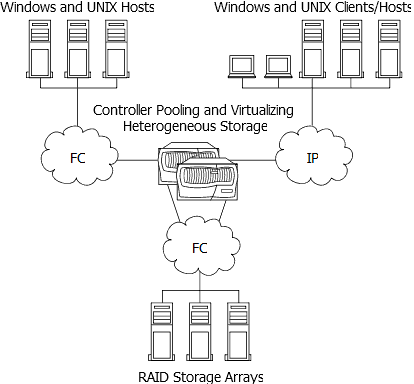

= FlexArray虚拟化技术概述—​using用于存储的阵列LUN
:allow-uri-read: 
:icons: font
:imagesdir: ../media/

[role="lead"]
ONTAP软件提供了一个统一的存储软件平台、可简化存储阵列上本机磁盘架和LUN的管理。您可以根据需要随时随地添加存储、而不会造成中断。此功能由以前称为V系列的_ FlexArray虚拟化软件_提供。

下图显示了一种配置、其中、已获得连接到存储阵列的许可的ONTAP系统将存储阵列中的LUN整合在一起、并将该存储提供给客户端。

ONTAP系统以ONTAP文件系统卷的形式向客户端提供存储、您可以使用ONTAP管理功能在系统上管理此卷、也可以将存储作为SCSI目标来创建供客户端使用的LUN。在这两种情况下(文件系统客户端和LUN客户端)、在可以使用阵列LUN的系统上、您可以将阵列LUN组合成一个或多个阵列LUN聚合。在ONTAP环境中、您可以将这些阵列LUN聚合与Storage Virtual Machine (SVM)相关联、并创建ONTAP卷、以便作为文件或ONTAP提供的LUN提供给客户端。
