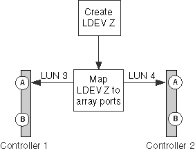

= 同一LEV的LUN ID不匹配
:allow-uri-read: 
:icons: font
:imagesdir: ../media/

[role="lead"]
逻辑设备(LDEV)必须映射到所有存储阵列端口上的相同LUN ID、并且此LUN ID必须对ONTAP系统可见。输出将 `storage errors show` 标识LUN ID不匹配的LEV。

如果LUN ID不匹配、则ONTAP不允许将阵列LUN分配给ONTAP系统。

== storage errors.显示消息

[listing]
----

HIT-1.4 (4849544143484920443630303035323430303132): This Array LUN is using multiple LUN IDs.  Only one LUN ID per serial number is supported.
----

== 说明

在存储阵列配置期间发生以下错误之一：

* LEV会从多个目标端口提供给ONTAP系统的同一个FC启动程序端口、并且LUN ID不一致。
* 此时将交换两个LEVS的LUN ID。
+
在这种情况下、系统会为每个阵列LUN报告一个错误。

* 将LEV映射到向ONTAP系统提供LEV的存储阵列端口时、会使用同一LEV的不同LUN ID。

[NOTE]
====
此错误更可能发生在单独配置每个端口的存储阵列上、例如、在Hitachi存储阵列上。在某些存储阵列(例如IBM存储阵列)上、端口未单独配置。

====
* 映射LUN的端口上的卷集寻址设置不一致。
+
在EMC Symmetrix存储阵列上、问题可能是通道控制器端口上的卷集寻址设置有所不同。

== 问题场景

此方案讨论了LUN ID不一致的情况、因为它适用于大多数存储阵列。请参见卷集寻址不一致一节、了解在卷集寻址配置不当的背景下有关此相同错误消息的讨论。

xref:reference_volume_set_addressing_is_inconsistent.adoc[卷集寻址不一致]

假设存储阵列管理员创建了一个新的LEV Z。LEV Z的LUN ID应为LUN 3。但是、管理员在存储阵列控制器端口1A上将LEV Z显示为LUN 3、在存储阵列控制器端口2A上显示为LUN 4、如下图所示：

要解决此问题、必须在LEV所映射到的所有端口上为LEV分配相同的LUN ID。在此示例中、LEV应在两个端口上显示为LUN ID 3。

== 故障排除和问题解决

要解决此问题、存储阵列管理员必须使用正确的LUN ID重新映射此LUN。您可以使用ONTAP命令获取向存储管理员提供有关问题的信息所需的详细信息。

. 查看 `storage errors show` 输出以确定LUN ID不匹配的阵列LUN。
+
如果同一LEV的LUN ID不匹配、则输出将确定存在问题的LEV的序列号。例如：

+
[listing]
----

mysystem1a::> storage errors show
Disk: HIT-1.4
UID: 48495441:43484920:44363030:30353234:30303132:00000000:...
----------

HITACHI_DF600F_1
----------
HIT-1.4 (4849544143484920443630303035323430303132): This Array LUN is using multiple LUN IDs.  Only one LUN ID per serial number is supported.
----
+
[NOTE]
====
此示例中的UID为48495441：43484920：44363030：30353234：30303132：00000000：00000000：00000000：00000000：00000000：00000000：00000000。在本示例中、由于空间原因、此名称会被截断。

====
. 输入以下命令、以获取有关同一LDEV正在使用哪些LUN ID的详细信息： `storage disk show arrayLUNname`
+
 `storage disk show`此示例的输出如下所示：

+
[listing]
----

mysystem1a::> storage disk show -disk HIT-1.4
                  Disk: HIT-1.4
        Container Type: unassigned
            Owner/Home: -  / -
               DR Home: -
                 Array: HITACHI_DF600F_1
                Vendor: HITACHI
                 Model: DF600F
         Serial Number: D600020C000C
                   UID: 48495441:43484920:44363030:30353234:30303132:00000000:...
                   BPS: 512
         Physical Size: -
              Position: present
Checksum Compatibility: block
             Aggregate: -
                  Plex: -
Paths:
                     LUN  Initiator Side  Target Side
Controller Initiator ID   Switch Port     Switch Port      Acc Use  Target Port     TPGN...
---------- --------- -------------------- ----------------- --- ---  --------------- ----
mysystem1a   0c       4  vgci9148s76:1-2  vgci9148s76:1-9  AO  INU  50060e80004291c1  1
mysystem1a   0a       3  vgbr300s89:1     vgbr300s89:9     S   RDY  50060e80004291c0  2
mysystem1b   0c       4  vgci9148s76:1-4  vgci9148s76:1-9  AO  INU  50060e80004291c1  1
mysystem1b   0a       3  vgbr300s89:3     vgbr300s89:10    S   RDY  50060e80004291c2  2

Errors:
HIT-1.4 (4849544143484920443630303035323430303132): This Array LUN is using multiple LUN IDs.  Only one LUN ID per serial number is supported.
----

[NOTE]
====
此示例中的UID为48495441：43484920：44363030：30353234：30303132：00000000：00000000：00000000：00000000：00000000：00000000：00000000。在本示例中、由于空间原因、此名称会被截断。

====
通过查看storage disk show输出的paths部分中的LUN ID、您可以看到此LDEV同时使用了LUN ID 3和4。

. 确定LDEV的LUN ID不正确。
+
在此示例中、LUN ID 4是不正确的LUN ID。

. 在ONTAP中、使用 `storage path quiesce` 命令将不正确的阵列LUN路径置于静状态。
+
以下示例显示了要添加到命令中的选项、这些选项用于启动程序0c上要 `storage path quiesce` 静置的路径--LUN ID 4。

+
[listing]
----

storage path quiesce -node mysystem1a -initiator 0c -target-wwpn 50060e80004291c1 -lun-number 4
----
+
 `storage path quiesce`命令会暂时暂停对特定路径上的特定阵列LUN的I/O。在删除或移动阵列LUN时、某些存储阵列需要在一段时间内停止I/O。

+
路径处于静状态后、ONTAP将无法再看到该LUN。

. 等待一分钟、让存储阵列的活动计时器过期。
+
虽然并非所有存储阵列都需要在一段时间内停止I/O、但最好这样做。

. 在存储阵列上、在此方案中使用正确的LUN ID (LUN ID 3)将LUN重新映射到目标端口。
+
下次运行ONTAP发现过程时、它将发现新的阵列LUN。发现每分钟运行一次。

. ONTAP发现完成后、在ONTAP中再次运行 `storage array config show` 以确认不再出现错误。

